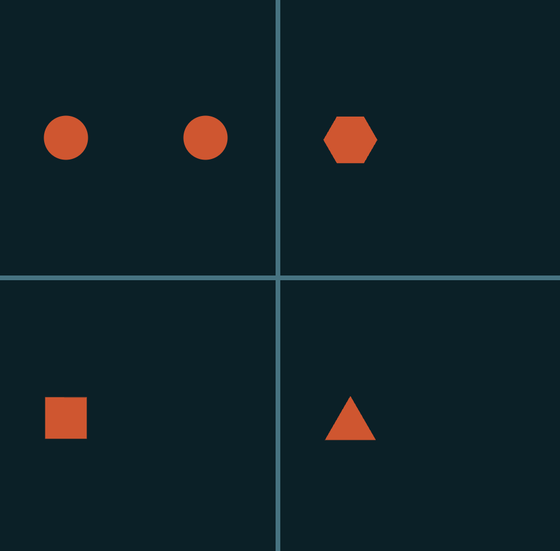

## Drag and Drop Shape Transformation

To access the page, go to: https://gallahron.github.io/Drag-and-Drop-Shape-Transformation/

### Stack Choice

For this task, I've chosen Vanilla HTML, JS, and CSS as using a more complex component framework seemed overkill for the level of functionality required.

Most of the task revolved around implementing the drag and drop logic in JS; so using a single IIFE allowed this to be implemented quickly without having to worry about communication between multiple components / classes.

### Running From Clean Code

The HTML file can be run by opening it via a web browser from local disk, or using a web server to serve the page remotely.
